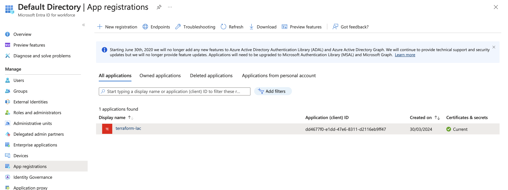
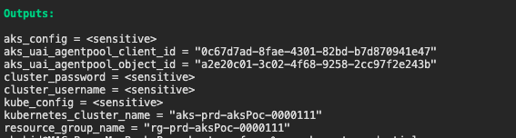

# Create a SP with contributor role 
[SP Terraform IaC](https://learn.microsoft.com/en-us/azure/aks/learn/quick-kubernetes-deploy-terraform?tabs=bash&pivots=development-environment-azure-cli#specify-service-principal-credentials-in-a-terraform-provider-block)
# Cloud Application Administrator
az ad sp create-for-rbac --name terraform-Iac --role Contributor --scopes /subscriptions/<subscription_id>

{
  "appId": "dd4677f0-e1dd-47e6-8311-d2116eb9ff47",
  "displayName": "terraform-Iac",
  "password": "<Password>",
  "tenant": "<tenantID>"
}

# Create the backend storage account for terraform state

- az login 
- az group create -l westeurope -n <rg_name>
- az storage account create --name <stAccount_name> --resource-group <rg_name> --access-tier Hot --sku Standard_LRS
- az storage container create -n tfstate --account-name <stAccount_name> --auth-mode login
- terraform init -reconfigure -backend-config="key=env-prd.tfstate"
- terraform fmt -recursive
- terraform validate
- terraform plan -var-file="vars/global.tfvars" -var-file="vars/env-prd.tfvars"
- terraform apply -var-file="vars/global.tfvars" -var-file="vars/env-prd.tfvars" --auto-approve

# K8s Deployment

***Important***

If you encounter an error when attempting to re-run terraform apply, please execute the following command lines:

az account set --subscription <YOUR_SUBSCRIPTION_ID>
az aks get-credentials --resource-group rg-prd-aksPoc-0000111 --name aks-prd-aksPoc-0000111 --overwrite-existing
#